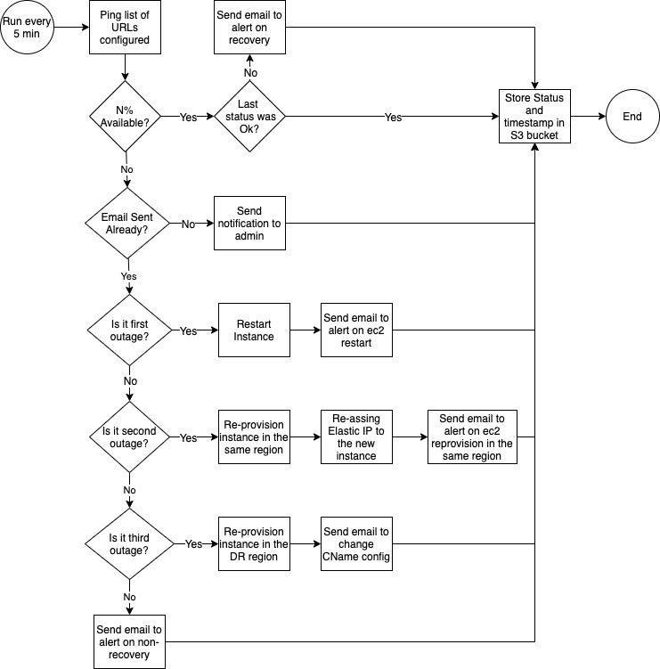

# Aws Ec2 Auto Recovery

## Overview

## Objectives

* Monitor availability of web-sites hosted on a single EC2 instance
* On first failure restart the instance
* On second failure re-provision the instance from a snapshot in the same region and re-assign Elastic Ip
* On third failure re-provision the instance in DR region
* Send email notification when more than 3 errors in a row have occurred, when a instance is getting provisioned in a DR region, and when an instance comes back-online after an outage

## Scope

* Record monitoring status to Aws S3 Bucket
* Deliver functionality using a suitable service on Aws
* Document deployment and testing process using markdown format
* Walk through the implementation and setup
* Assist with setup on customer environment

## Assumptions

* The monitoring is running in a single region
* When monitoring region is unavailable the monitoring system will be unavailable 
* Target EC2 instance is tagged
* Snapshots suitable for restore are available in both regions
* Snapshots are tagged and latest available will be used to re-provision the failed instance
* In case snapshot is unavailable - re-provisioning process will fail
* Non-recoverable errors will be written to log and will require human intervention

## Artifacts

* [Draw.io diagram](./docs/RevizeMonitoring.drawio)